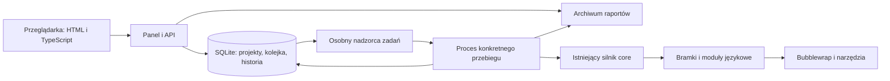

# Plan panelu WWW dla llm-code-gatekeeper

Status: **etapy 0–6 zaimplementowane** w pakiecie [`web/`](web/) — kontrakt
danych, przeglądarka raportów, rejestr projektów i profili polityki, kolejka
z osobnym nadzorcą, realne uruchamianie kontroli z postępem i anulowaniem,
oceny znalezisk, incydenty i metryki, opcjonalna sesja kodem startowym,
kopia bazy.
Testy przeglądarkowe ze sterownikiem i kasująca retencja pozostają poza
wydaniem (patrz [`web/CONTRACT.md`](web/CONTRACT.md) §11). Rozdz. 10 (zespół,
GitHub/GitLab) jest poza MVP.
Kontrakt i granica wydania: [`web/CONTRACT.md`](web/CONTRACT.md).
Data: 7 września 2026.

## 1. Cel i założenia

Użytkownik ma otworzyć stronę w przeglądarce, wybrać projekt i zmianę w Git,
uruchomić kontrolę oraz zrozumieć wynik bez znajomości poleceń terminala.
Panel ma też umożliwić ocenę znalezisk, ponowienie sprawdzenia i zarządzanie
wersjami zasad oceny.

Pierwsza wersja działa lokalnie na Linuksie, dla jednego operatora, z kilkoma
zarejestrowanymi repozytoriami. Dostęp zespołowy z logowaniem będzie osobnym
etapem. To założenie planu, nie dodatkowe wymaganie podane przez użytkownika.

Przykładowa ścieżka użytkownika:

1. Otwórz panel i wybierz projekt „Taskboard”.
2. Wybierz wersję bazową `demo-clean` i wersję do sprawdzenia
   `demo/gatekeeper-faults`.
3. Wybierz profil polityki i opcjonalnie podaj numer zadania.
4. Zobacz dokładny zakres zmiany i naciśnij „Uruchom kontrolę”.
5. Obserwuj postęp; po zakończeniu otwórz przyczyny BLOCK i konkretne znaleziska.
6. Oznacz błędny alarm, dodaj komentarz lub pobierz pełny raport.

„Polityka” oznacza zestaw zasad, według których wyniki kontroli prowadzą do
decyzji. „Przebieg” to jedno sprawdzenie konkretnej pary wersji projektu.
„Znalezisko” to wykryty problem z lokalizacją i opisem skutków.

## 2. Co już istnieje i co trzeba dołożyć

Plan opiera się na aktualnych plikach roboczych repozytorium, również na
obecnych lokalnych zmianach. Przed implementacją trzeba uzgodnić stabilny
commit bazowy dla prac nad panelem.

| Obszar | Obecny stan | Planowana integracja |
|---|---|---|
| Uruchamianie | [CLI](core/gatekeeper_core/cli.py) ładuje politykę, ustala zakres Git i wywołuje silnik | Wspólna usługa używana przez CLI i proces obsługujący zadania WWW |
| Ocena zmiany | [Orkiestrator](core/gatekeeper_core/core/orchestrator.py) uruchamia bramki i buduje `RunResult` | Zachować tę samą logikę decyzji; dodać obserwowanie postępu |
| Izolacja | [execution.py](core/gatekeeper_core/core/execution.py) i [runner.py](core/gatekeeper_core/core/runner.py) nadzorują procesy i Bubblewrap | Zachować izolację, limity i sprzątanie; rozszerzyć obsługę anulowania |
| Wynik | [finding.py](core/gatekeeper_core/core/finding.py) definiuje decyzje, fakty i znaleziska | Wersjonowany kontrakt danych dla API i importu raportów |
| Eksport | [report.py](core/gatekeeper_core/core/report.py) tworzy Markdown, JSON i dane GitHub Checks | Użyć JSON jako wejścia widoku; dodać samodzielny raport HTML |
| Historia | [Store](core/gatekeeper_core/core/store.py) zapisuje zakończone przebiegi w SQLite | Dodać stronicowane odczyty, import i dane o zadaniach oczekujących |
| Ocena alarmów | `record_verdict()` zapisuje ocenę trafności; `mark_incident()` oznacza incydent | Formularze WWW z historią zmian i kontekstem projektu |
| Metryki | [metrics.py](core/gatekeeper_core/core/metrics.py) liczy wyniki z historii | Widok zbiorczy i filtry po projekcie oraz okresie |
| Polityki | [policy.py](core/gatekeeper_core/core/policy.py) ładuje, sprawdza i stosuje YAML | Podgląd, wersjonowanie, szkice i jawna aktywacja przez operatora |

Najważniejsze braki: serwer HTTP, widoki HTML, trwała kolejka zadań,
informacja o bieżącym postępie, anulowanie z poziomu użytkownika i kompletny
zapis wejścia konkretnego przebiegu.

Obecna baza nie jest pełnym archiwum JSON: nie zachowuje wszystkich danych
`evidence`, listy `not_checked` ani podziału powodów na ostrzeżenia i blokady
w postaci równoważnej oryginalnemu raportowi. Panel nie może odtwarzać
brakujących informacji przez zgadywanie.

## 3. Zakres pierwszej wersji

### Ekrany

| Ekran | Zawartość i dostępne działania |
|---|---|
| Pulpit | Ostatnie przebiegi, zadania w kolejce, BLOCK/PASS/PASS-WITH-REVIEW, problemy środowiska |
| Projekty | Nazwa, lokalne repozytorium, języki, dostępne profile polityki, ostatni wynik; dodanie i archiwizacja wpisu |
| Nowa kontrola | Wybór projektu, bazy, ocenianej wersji, profilu i ticketu; podgląd zakresu przed uruchomieniem |
| Historia | Filtrowanie po projekcie, czasie, decyzji i stanie zadania; stronicowanie |
| Szczegóły przebiegu | Przyczyny decyzji, bramki, fakty, znaleziska, ograniczenia, wersje narzędzi, pobieranie raportów |
| Znalezisko | Plik i linia, reguła, waga, scenariusz awarii, zredagowane dowody, oceny operatora |
| Polityki | Podgląd zasad i wyjątków, walidacja, porównanie wersji; edycja w późniejszym etapie MVP |
| Środowisko | Zainstalowane moduły językowe i narzędzia, Bubblewrap, stan zależności projektu, miejsce na dysku |

Interfejs po polsku, dostosowany do telefonu i komputera. Obsługa klawiatury,
czytelny fokus, etykiety formularzy i komunikaty tekstowe oprócz kolorów.
Lista znalezisk musi pokazywać liczbę wszystkich wyników i umożliwiać ich
przeglądanie; limit 10 znalezisk stosowany w krótkim raporcie Markdown nie
ogranicza panelu.

### Poprawne przedstawienie wyniku

W szczegółach należy rozdzielić trzy pojęcia:

| Poziom | Przykładowe wartości | Znaczenie |
|---|---|---|
| Zadanie | W kolejce, trwa, zakończone, anulowane, przerwane, awaria | Czy udało się wykonać pracę i zapisać wynik |
| Bramka | `pass`, `fail`, `error`, `skipped` | Wynik pojedynczej kontroli |
| Polityka | PASS, PASS-WITH-REVIEW, BLOCK | Decyzja o ocenianej zmianie |

Zakończone zadanie z decyzją BLOCK jest poprawnie wykonanym sprawdzeniem.
Błąd pojedynczej bramki może występować w kompletnym raporcie i wymaga
widocznego wyjaśnienia braku dowodu.

W naszym przykładzie `G2.diff_coverage` oddało `pass`, lecz zmierzyło tylko
1/37 pokrytych linii. Panel powinien pokazać „Pokrycie 2,7%; wymagane 80%;
naruszenie polityki”, zachowując surowy status bramki w szczegółach.
Analogicznie należy obsłużyć pomiary zakresu, `warn_only`, wyjątki,
nierozwiązane pakiety i brak dostępnego kompilatora.

### Granica MVP

MVP obejmuje rejestrację lokalnych projektów, historię, import raportów,
uruchamianie, postęp, anulowanie, eksport, ocenę znalezisk i zarządzanie
lokalnymi profilami polityki. Pełny edytor plików źródłowych, instalacja
pakietów z przycisku, klonowanie dowolnych adresów Git, automatyczne naprawy,
publikowanie komentarzy w GitHubie i logowanie zespołowe są poza MVP.

## 4. Proponowana architektura

Nowy, opcjonalny pakiet Pythona `llm-code-gatekeeper-web` w katalogu `web/`.
Zależy od `core`; pakiety `core`, `python`, `ts` i `csharp` zachowują swoją
samodzielność. Dotychczasowe CLI nadal działa bez instalacji panelu.

| Warstwa | Propozycja | Powód |
|---|---|---|
| Serwer HTTP | Python, FastAPI, Uvicorn | Bezpośrednia integracja z istniejącymi modelami Pythona; walidowane API |
| Strony | Jinja2, HTML i CSS | Widoki renderowane przez serwer, łatwe do odczytu i eksportu |
| Interakcje | Niewielkie moduły TypeScript | Odświeżanie postępu, filtry i formularze; kompilowane zasoby w pakiecie |
| Stan panelu | SQLite | Historia i kolejka trwałe po restarcie, bez osobnego serwera bazy w MVP |
| Wykonanie | Osobny proces nadzorcy i proces dla przebiegu | Izolacja czasu życia serwera WWW od długich analiz |
| Raporty | JSON i Markdown silnika oraz HTML | Wspólne dane dla widoku i eksportu |

FastAPI udostępnia integrację z szablonami Jinja2 i plikami statycznymi;
opisuje ją [oficjalna dokumentacja szablonów](https://fastapi.tiangolo.com/advanced/templates/).
Analizy należy skierować do osobnego procesu: dokumentacja rozróżnia drobne
zadania po odpowiedzi HTTP i cięższe prace wymagające osobnego wykonania.
To podstawa wyboru nadzorcy w tym planie, a nie wymóg konkretnego systemu kolejek.
[Dokumentacja zadań w tle](https://fastapi.tiangolo.com/tutorial/background-tasks/).



Nie należy wywoływać `run_gates()` w obsłudze żądania HTTP ani przez zwykłe
zadanie w wątku serwera. Obecne `execution.py` używa `fork` i zakłada
nadzorcę bez wątków. Proces wykonujący przebieg uruchamiamy jako osobny
program Pythona, z argumentami jako listą i bez powłoki.

MVP uruchamia jeden przebieg naraz. Wewnątrz niego pozostaje obecna
równoległość bramek. Zapobiega to przypadkowemu przemnożeniu zużycia pamięci,
procesorów i miejsca na kopie repozytoriów.

Proponowana, jeszcze nieistniejąca komenda startowa:

```bash
gatekeeper-web serve --host 127.0.0.1 --port 8080 --state-dir /ścieżka/do/stanu-panelu
```

Polecenie ma uruchamiać API i osobnego nadzorcę oraz poprawnie zatrzymywać
oba procesy. Zbudowany pakiet zawiera CSS i JavaScript; użytkownik końcowy
nie musi instalować Node.js do uruchomienia samego panelu.

## 5. Integracja z silnikiem, kolejka i dane

### Wspólna usługa uruchamiania

Wydzielić z `cli.run()` mały interfejs przygotowania i wykonania kontroli.
Ma przyjmować jawne dane wejściowe, a zwracać `RunResult`. CLI i proces
panelu korzystają z tej samej walidacji i logiki oceny. Formatowanie
komunikatów terminala, odpowiedzi HTTP i kody wyjścia pozostają w adapterach.

API nie przyjmuje dowolnych poleceń, ścieżki interpretera, nazw pluginów ani
zmiennych środowiskowych do wykonania. Użytkownik wybiera zarejestrowany
projekt i dozwolony profil kontroli.

### Niezmienny zakres przebiegu

Przy zatwierdzeniu formularza należy ustalić i zapisać:

- identyfikator projektu, kanoniczną ścieżkę oraz tożsamość repozytorium;
- wybrane nazwy Git, odpowiadające im SHA i faktyczny merge-base użyty w diffie;
- treść i skróty polityki, wyjątków oraz mapy zakresu;
- ticket, wybrane bramki i ustawienie ścieżki szybkiej;
- wersje core, modułów językowych i wykrytych narzędzi;
- identyfikatory lockfile'ów i stan przygotowania zależności.

Zadanie wykonuje dokładnie te dane, nawet jeśli później przesunie się gałąź
lub operator zmieni aktywną politykę. Ponowienie tworzy nowe zadanie i nowy
identyfikator przebiegu; widok rozróżnia „powtórz ten sam zakres” oraz
„sprawdź najnowszą wersję”. Nie gwarantujemy identycznego wyniku SCA w czasie,
ponieważ rejestry podatności się zmieniają.

Polityka i `exceptions.yaml` pochodzą z zatwierdzonego profilu operatora,
nie z niezaufanego ocenianego commita. Snapshot mapy zakresu również musi
być faktycznie przekazany bramce G0; samo zapisanie go w bazie nie wystarcza.

### Model danych panelu

Stan panelu jest poza ocenianymi repozytoriami. Centralna baza SQLite
przechowuje zadania i indeks raportów; kompletne raporty stanowią archiwum
wyników. Dotychczasowe `.gatekeeper/runs.db` pozostają źródłem danych CLI.

| Encja | Najważniejsze dane |
|---|---|
| `projects` | ID, nazwa, kanoniczna ścieżka, ustawienia profili, archiwizacja |
| `policy_profiles` / `policy_revisions` | Wersja, treść, hash, właściciel, stan szkicu/aktywnej wersji |
| `jobs` | ID, zamrożone wejście, stan, czasy, żądanie anulowania, lease nadzorcy, opcjonalny `run_id` |
| `job_events` | Numer kolejny, czas, typ zdarzenia, bramka, bezpieczny komunikat |
| `run_reports` | Projekt, `run_id`, wersja formatu, hash i treść/ścieżka kompletnego raportu |
| `reviews` | Projekt, przebieg, fingerprint, ocena operatora, autor, komentarz i czas |
| `audit_events` | Rejestracja projektu, uruchomienie, anulowanie, zmiana profilu i oceny |

Identyfikator zadania powstaje przed startem. Obecny `run_id` powstaje po
wykonaniu `run_gates()`; dlatego oba identyfikatory pozostają rozdzielone.

Na indeksach używać klucza `(project_id, run_id)` oraz kontekstu projektu
dla fingerprintów. Fingerprint w core nie zawiera repozytorium, więc sam
ciąg znaków nie wystarcza do globalnego przypisania oceny.

Zapis końcowy jest idempotentny. Powtórne dostarczenie tego samego raportu
nie tworzy duplikatu; ten sam identyfikator z inną treścią zgłasza konflikt.
Krótka transakcja SQLite, migracje wersjonowane, timeout oczekiwania na blokadę
i testy równoległego odczytu podczas zapisu. Pliki archiwum zapisuje się
atomowo; zadanie jest zakończone dopiero po utrwaleniu raportu i indeksu.

### Import istniejących wyników

Najpierw obsłużyć import JSON po sprawdzeniu schematu, limitu rozmiaru,
liczby znalezisk i długości pól. Stary format bez numeru wersji obsłużyć
jawnym adapterem. Importowany raport ma oznaczenie „zaimportowany” i nie
uruchamia automatycznie projektu wskazanego w jego polu `repo`.

Następnie umożliwić odczyt wskazanej bazy CLI w trybie tylko do odczytu.
Nie tworzyć brakującej bazy przez konstruktor `Store` podczas importu.
Pola nieobecne w historycznej bazie pokazać jako „brak danych”.

### Postęp, anulowanie i restart

API zapisuje zadanie i odpowiada `202 Accepted`. Przeglądarka odczytuje
postęp co około 2 sekundy, pobierając zdarzenia od ostatniego numeru.
SSE można dołożyć później bez zmiany modelu zdarzeń.

Do silnika dodać opcjonalny odbiornik zdarzeń: przygotowanie kopii,
start bramki, zakończenie bramki, timeout i sprzątanie. Odbiornik działa
w procesie nadzorującym, a nie w niezaufanym kodzie testów. Pokazywać
„ukończono 6 z 11 kontroli”; to nie jest procent pozostałego czasu.

Stany zadania: `queued` → `preparing` → `running` → `completed`.
Dodatkowe zakończenia: `cancelled`, `interrupted`, `failed`.
Podczas zatrzymywania widoczny jest stan `cancelling`; wynik polityki
pozostaje pusty, jeśli nie powstał pełny raport.

Anulowanie przekazać do orkiestratora i pętli `run_wave`, z ograniczonym
czasem oczekiwania na sygnał. Należy zamknąć wszystkie aktywne grupy procesów
bramek i ich zasoby. Samo zabicie procesu API lub rodzica nie wystarcza,
ponieważ workery bramek tworzą własne sesje przez `setsid()`.

Nadzorca ma blokadę pojedynczej instancji i heartbeat. Po restarcie sprawdza
stan pozostawionych procesów i kopii, oznacza niedokończone zadania jako
przerwane, a osierocone zasoby usuwa według własnej ewidencji. Nie uruchamia
ponownie przerwanego sprawdzenia bez jawnego ponowienia. Wyścig między
zakończeniem a anulowaniem rozstrzyga jedna atomowa zmiana stanu.

## 6. Zarządzanie znaleziskami i politykami

Ocena znaleziska: „potwierdzony problem” lub „fałszywy alarm”, komentarz,
autor i czas. Zmiana oceny dopisuje wpis historii. Ocena nie zmienia
oryginalnej decyzji przebiegu i nie tworzy automatycznie wyjątku od reguły.
Oznaczenie incydentu jest osobnym działaniem dotyczącym przebiegu.

Przed wykorzystaniem obecnych metryk zweryfikować sposób liczenia ostatniej
oceny: obecne łączenie `findings` z całą historią `verdicts` może powielać
wiersze. W panelu ocena musi być jednoznaczna dla projektu i znaleziska,
a metryki muszą jawnie określać, czy liczą wystąpienia, czy unikalne problemy.

Zarządzanie polityką wdrożyć w kolejności:

1. Czytelny podgląd progów, `warn_only`, błędów bramek, wyjątków i ich terminów.
2. Utworzenie szkicu na podstawie zatwierdzonej wersji.
3. Walidacja przez istniejące `Policy.load()` i `lint()` z zainstalowanymi modułami.
4. Porównanie ze starą wersją i wskazanie, które blokady stają się ostrzeżeniami.
5. Jawna aktywacja przez operatora; zapis autora, uzasadnienia i hasha wersji.

Aktywacja dotyczy przyszłych zadań. Odtworzenie historycznego widoku używa
ówczesnej decyzji i profilu. Profil lokalny panelu nie zmienia automatycznie
polityki CI w Git; panel może wyeksportować patch do osobnego przeglądu.
Wygasłe wyjątki i ograniczenia ich czasu życia waliduje core.

## 7. Proponowane API i organizacja plików

Poniższe endpointy i pliki są planem, a nie istniejącym interfejsem.

| Metoda i ścieżka | Działanie |
|---|---|
| `GET /api/v1/projects` | Lista projektów |
| `POST /api/v1/projects` | Rejestracja lokalnego repozytorium |
| `PATCH /api/v1/projects/{id}` | Nazwa, przypisanie profilu, archiwizacja |
| `GET /api/v1/projects/{id}/refs` | Dozwolone wersje Git |
| `POST /api/v1/projects/{id}/preview` | Walidacja i podgląd dokładnego zakresu |
| `POST /api/v1/jobs` | Zlecenie kontroli, odpowiedź 202 z ID zadania |
| `GET /api/v1/jobs/{id}` | Stan i parametry zadania |
| `GET /api/v1/jobs/{id}/events?after=N` | Przyrostowy postęp |
| `POST /api/v1/jobs/{id}/cancel` | Idempotentne żądanie anulowania |
| `POST /api/v1/jobs/{id}/retry` | Nowe zadanie z zapisanym zakresem |
| `GET /api/v1/projects/{id}/runs` | Historia z filtrami i stronicowaniem |
| `GET /api/v1/projects/{id}/runs/{run_id}` | Kompletny zapisany wynik |
| `GET /api/v1/projects/{id}/runs/{run_id}/report?format=html` | Eksport HTML, Markdown albo JSON |
| `POST /api/v1/projects/{id}/runs/{run_id}/findings/{fingerprint}/reviews` | Ocena znaleziska |
| `POST /api/v1/projects/{id}/runs/{run_id}/incidents` | Oznaczenie incydentu |
| `POST /api/v1/reports/import` | Import JSON do wskazanego projektu |
| `GET /api/v1/policies` | Profile i wersje |
| `POST /api/v1/policies/{id}/drafts` | Szkic profilu |
| `POST /api/v1/policy-revisions/{id}/validate` | Walidacja szkicu |
| `POST /api/v1/policy-revisions/{id}/activate` | Aktywacja przez uprawnionego operatora |
| `GET /api/v1/environment` | Dostępność narzędzi i modułów |
| `GET /api/v1/metrics?project_id=...` | Statystyki z wyjaśnieniem brakujących danych |

Przykładowa struktura:

```text
web/
  pyproject.toml
  README.md
  gatekeeper_web/
    app.py                 # aplikacja i konfiguracja HTTP
    cli.py                 # start panelu i nadzorcy
    api/                   # walidowane endpointy
    services/              # projekty, profile, import i odczyt raportów
    jobs/                  # kolejka, nadzorca i proces przebiegu
    storage/               # repozytoria danych i migracje
    templates/             # strony HTML i raport do eksportu
    static/                # CSS i zbudowany JavaScript w pakiecie
  frontend/                # źródła TypeScript
  tests/                   # API, kolejka, import i integracja z core
  e2e/                     # testy przeglądarkowe
```

Nazwy i zależności wersjonować w manifestach oraz lockfile'ach przy rozpoczęciu
implementacji. API posiada własną wersję; surowe raporty zachowują oryginalne
pola i mają opisany adapter do modelu widoków. Nowe bramki z entry points
powinny pojawiać się w panelu bez dopisywania listy 11 identyfikatorów w HTML.

## 8. Dostęp i ochrona wykonywania kodu

Panel uruchamia narzędzia na lokalnym kodzie, dlatego granice dostępu są
częścią funkcji zarządzania, a nie dodatkiem po wystawieniu serwera.

- Domyślny nasłuch tylko na `127.0.0.1`. Sesja operatora zakładana jednorazowym
  kodem startowym; sekret sesji nie trafia do URL raportu ani logów.
  **Zrealizowane inaczej, świadomie:** sesja jest opcją (`--wymagaj-logowania`),
  a nie domyślnym zachowaniem. Dla jednego operatora na własnej maszynie kod
  przepisywany z terminala okazał się kosztem bez odbiorcy; obrona sprowadza
  się wtedy do pętli zwrotnej, kontroli `Host`, CSRF i `Origin`. Gdy z maszyny
  korzysta ktoś jeszcze, flaga przywraca pełny model z tego punktu.
- Walidacja nagłówka Host i Origin, ochrona CSRF operacji zapisujących,
  ciasteczko HttpOnly/SameSite; brak otwartego CORS. Ciasteczko Secure przy HTTPS.
- Rejestracja repozytorium wyłącznie w dozwolonych katalogach. Normalizacja
  ścieżek, sprawdzenie dowiązań i repozytoriów Git również przy wykonaniu.
- Parametry Git weryfikowane jako obiekty commit, przekazywane jako argumenty,
  z rozdzieleniem opcji; pole tekstowe nie staje się komendą powłoki.
- Projekt, skanowany kod i importowany raport nie wybierają interpretera,
  pluginów, polityki wykonania ani dodatkowych katalogów hosta do montowania.
- Zachować ograniczenia opisane w [SECURITY.md](core/SECURITY.md). Przy braku
  Bubblewrap panel wyjaśnia błąd; nie proponuje uruchomienia bez izolacji.
- Opisy, ścieżki, komentarze i dowody renderowane jako tekst z escapowaniem.
  Raport HTML nie wykonuje kodu z repozytorium. CSP i zasoby lokalne, bez CDN.
- Nie pokazywać surowych sekretów ani pełnego stdout narzędzi. Limity danych
  i redakcja obowiązują też dla importu, eksportu i zdarzeń postępu.
- Odczyt kodu przy znalezisku wyłącznie ze wskazanego SHA zarejestrowanego
  repozytorium, w ograniczonym zakresie linii i po redakcji. Na początek
  wystarczy lokalizacja oraz bezpieczny dowód ze skanera.
- Artefakty pobierane przez ID, nie przez dowolną ścieżkę z parametru żądania.
  Tymczasowe ścieżki z surowego raportu nie są automatycznie udostępniane przez HTTP.
- Zachować ślad działań operatora. Archiwizacja projektu nie usuwa jego plików
  ani repozytorium. Reguły retencji raportów i kopie zapasowe wdrożyć przed
  automatycznym usuwaniem historii.

## 9. Kolejność wdrożenia i kryteria odbioru

Każdy etap jest osobną zmianą do przeglądu. Najpierw powstaje użyteczny widok,
a dopiero potem operacje wykonujące kod.

| Etap | Prace | Warunek zakończenia |
|---|---|---|
| 0. Kontrakt i baza prac | Ustalenie commita core, formatów JSON, rozdzielenia zadania od decyzji i katalogu stanu | Udokumentowany kontrakt oraz zestaw raportów do testów |
| 1. Przeglądarka raportów | Pakiet web, HTML, import JSON, historia, filtry, szczegóły, eksport HTML/MD/JSON | Wszystkie 22 znaleziska demonstracji są dostępne; zachowane powody BLOCK i ograniczenia |
| 2. Rejestr projektów i profile do odczytu | Projekty, wybór zakresu Git, podgląd profilu, diagnostyka środowiska, zabezpieczenia HTTP | Niepoprawna ścieżka lub SHA są odrzucane; formularz pokazuje dokładne wejście kontroli |
| 3. Kolejka i uruchamianie | Wspólna usługa core/CLI, SQLite jobs, osobny nadzorca, zamrożone wejście, raport końcowy | Ta sama kontrola z CLI i panelu ma zgodne decyzje, fakty i znaleziska |
| 4. Postęp i anulowanie | Zdarzenia silnika, odświeżanie, anulowanie aktywnych procesów, odtwarzanie po restarcie | Anulowanie sprząta procesy i kopie; restart nie gubi historii ani nie pokazuje fałszywego PASS |
| 5. Zarządzanie | Oceny alarmów, incydenty, poprawne metryki, szkice i aktywacja profili | Pełny audyt; ocena alarmu nie zmienia raportu; profil nie wpływa wstecz na zadania |
| 6. Gotowe MVP | Testy przeglądarkowe i bezpieczeństwa, pakowanie zasobów, migracje, backup, instrukcja | Panel działa po instalacji pakietu, a dotychczasowe CLI i moduły przechodzą testy regresji |

Estymację kalendarzową ustalić po etapie 0. Największą niewiadomą jest
zarządzanie procesami przy anulowaniu i restarcie oraz migracja historycznych
danych ocen. Wczesny etap 1 dostarcza użyteczny widok bez czekania na tę część.

### Scenariusze odbioru

1. Import rzeczywistego [raportu demonstracyjnego](../taskboard-demo/reports/deliberate-faults/demo.json):
   22 znaleziska, 11 kategorii, pięć testów przechodzących na starym kodzie,
   pokrycie 1/37 i widoczne naruszenia polityki mimo dwóch statusów `pass`.
2. Import [pierwszego raportu aplikacji](../taskboard-demo/reports/gatekeeper.json):
   widoczne nierozwiązane zależności i nierozstrzygnięte testy; brak dopisywania
   nieistniejącego dowodu poprawności.
3. Import raportu bez znalezisk i z brakującymi pomiarami: „brak danych”
   odróżnione od zera. Nie używać liczby wykrytych podatności jako stałego
   oczekiwania testu wykonującego zapytania do żywego rejestru.
4. Przebieg z UI na tej samej parze SHA i tym samym profilu co CLI. Porównać
   decyzję, reguły, fakty i fingerprinty, pomijając czas oraz nowe ID przebiegu.
5. Zamknięcie karty podczas analizy i ponowne wejście: zadanie nadal dostępne.
6. Podwójne kliknięcie „Uruchom”: klucz idempotencji zapobiega przypadkowemu
   podwójnemu zleceniu; jawne ponowienie tworzy nową pracę.
7. Anulowanie w kolejce, podczas przygotowania, testów oraz tuż przy zakończeniu.
8. Restart API i awaria nadzorcy: brak osieroconych analiz i jednoznaczny stan.
9. Testy wejść HTML/JS, CSRF, obcych originów, nieprawidłowych Host,
   dowiązań, wyjścia poza katalog projektu i wstrzyknięcia argumentów Git.
10. Dwukrotny import, konflikt ID, nieobsługiwana wersja JSON, zbyt duży raport
    i brak dostępu do bazy: czytelny błąd oraz zachowanie istniejących danych.
11. Migracja kopii starej bazy, wielokrotna zmiana oceny znaleziska, takie same
    fingerprinty w dwóch projektach: brak utraty historii i zawyżonych metryk.
12. Nowa wersja polityki i wygasły wyjątek: poprawna walidacja; stary raport
    pozostaje niezmienny. Prezentacja nie ukrywa ograniczeń, takich jak
    `static.tsc_available: false` ujawnione w demonstracji.

Raporty z sąsiedniego projektu służą jako materiał akceptacyjny. Do testów
repozytorium należy skopiować zredagowane, wersjonowane próbki, aby CI nie
zależało od lokalnej ścieżki `/home/tarze07/poligon/taskboard-demo`.

## 10. Rozwój po MVP

Wersja zespołowa wymaga jawnej zmiany modelu wdrożenia: HTTPS, logowania
OIDC/SSO, ról czytelnik/operator/administrator i autoryzacji każdego projektu.
Do tego centralna kolejka, osobne maszyny wykonujące analizy, bezpieczne
przygotowanie zależności i baza dobrana do wielu zapisujących procesów.
Nie wystarczy zmienić adresu nasłuchu na `0.0.0.0`.

Dalsze funkcje: integracja z PR-ami GitHub/GitLab, porównywanie przebiegów po
fingerprintach, harmonogramy, powiadomienia, kalibracja reguł oraz proponowanie
zmian polityki w osobnym PR. Publikowanie do usług zewnętrznych powinno mieć
oddzielnie skonfigurowane uprawnienia i świadomie włączoną automatyzację.

Pierwszy zakres do realizacji: **etapy 0–1, czyli przeglądarka istniejących
raportów z pełną interpretacją wyników i eksportem HTML**. Następny krok
to rejestr projektów i kolejka uruchamiania, na tym samym silniku co CLI.
